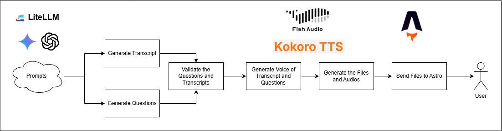

# CELPIPAI LISTENING PROJECT

## Overview
This document outlines the pipeline used to create a CELPIP (Canadian English Language Proficiency Index Program) listening simulator. The process leverages cutting-edge technologies and methodologies, including LiteLLM , Python , TTS models like Fish.ai and Kokoro-TTS, and an Astro front-end application for seamless user delivery.

The pipeline is designed to be flexible and agnostic to specific LLM models such as GPT-4 Mini , Mistral , or DeepSeek , ensuring adaptability and scalability. The backend logic is kept private in a parent folder, allowing me to maintain control over the core product while using Astro for the front-end interface.

## Pipeline Steps
1. Prompt Generation
    - Tool: LiteLLM, Python
    - Description: Generate prompts using LiteLLM as the foundation for creating relevant transcripts and questions. These prompts should align with the CELPIP format, ensuring that the generated transcripts and questions follow the structure and style proposed in the CELPIP guides. This step is agnostic to the specific LLM model used, such as GPT4-min, Mistral, DeepSeek, or others.
2. Transcript & Question Generation
    - Tools: LiteLLM, Python
    - Description: Create transcripts and questions based on the generated prompts using Python scripts. Ensure that the transcripts and questions adhere strictly to the CELPIP format, including the appropriate tone, level of formality, and content examples provided in the CELPIP guides. For instance, Part 1 should focus on problem-solving conversations, while Part 6 should involve formal speeches about specific topics.
3. Validation
    - Description: Validate the generated questions and transcripts to ensure they meet the required standards for accuracy, relevance, and adherence to the CELPIP format. This step is crucial to maintain the quality and effectiveness of the simulator.
4. Voice Generation
    - Tools: Fish.ai, Kokoro-TTS
    - Description: Convert validated transcripts and questions into realistic audio files using TTS models like Fish.ai and Kokoro-TTS. Given the complexity of different voices required for various parts of the test, ensure that the tool can generate distinct voices for different speakers. For example:
        - Fish.ai: Offers voice personalization capabilities, allowing you to customize the voice characteristics to match the conversational tones needed for Parts 1–3.
        - Kokoro-TTS: Provides control over speech speed, which is essential for simulating the varying paces of speech in different parts of the test, such as the faster pace in news reports (Part 4) versus the more deliberate pace in formal presentations (Part 6).
5. File Generation
    - Description: Compile all necessary files including audio files and documents, ensuring they are organized and ready for delivery.
6. Delivery to User
    - Tool: Astro
    - Description: Send the compiled files to the user through an Astro application, providing a seamless and user-friendly experience.

## CELPIP Listening Test Brief
The CELPIP Listening Test assesses spoken English comprehension across six parts, each with a specific format and tone:

- Parts 1–3: Multiple-choice questions focusing on problem-solving, daily life conversations, and information gathering.
- Parts 4–6: Sentence completion questions covering news items, discussions, and viewpoints.

Each part requires a unique approach, from conversational tones in Parts 1–3 to formal presentations in Part 6. Adhering to these formats ensures a comprehensive and accurate simulation of the actual CELPIP Listening Test.

## Key Characteristics of TTS Models
### Fish.ai
Voice Personalization: Allows customization of voice characteristics to match the conversational tones needed for different parts of the test.
Flexibility: Can generate a wide range of voices suitable for various scenarios, from informal conversations to formal presentations.
### Kokoro-TTS
Speed Control: Provides precise control over speech speed, enabling the simulation of different paces of speech as required by the test format.
Naturalness: Produces natural-sounding speech that enhances the realism of the listening experience.
By leveraging these tools and characteristics, the CELPIP Listening Simulator Pipeline effectively replicates the diverse listening scenarios encountered in the actual test, providing users with a robust and authentic practice environment.

## Sources
- https://fish.audio/
- https://kokorottsai.com/
- https://www.litellm.ai/
- https://openai.com/
- https://astro.build/